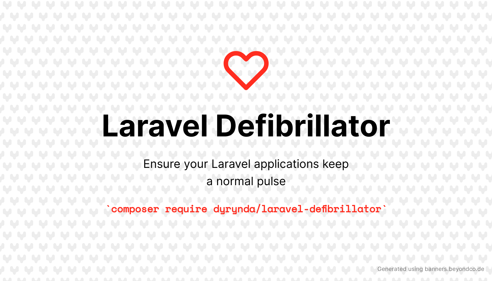

# Ensure your Laravel applications keep a normal rhythm

[](https://packagist.org/packages/dyrynda/laravel-defibrillator)
[](https://github.com/michaeldyrynda/laravel-defibrillator/actions?query=workflow%3Arun-tests+branch%3Amain)
[](https://github.com/michaeldyrynda/laravel-defibrillator/actions?query=workflow%3A"Check+%26+fix+styling"+branch%3Amain)
[](https://packagist.org/packages/dyrynda/laravel-defibrillator)

Laravel Defibrillator helps you ensure that aspects of your application that should be running at a regular interval are doing so.

## Installation

You can install the package via composer:

```bash
composer require dyrynda/laravel-defibrillator
```

You can publish the config file with:
```bash
php artisan vendor:publish --provider="Dyrynda\Defibrillator\DefibrillatorServiceProvider" --tag="laravel-defibrillator-config"
```

## Usage

When an abnormal heartbeat rhythm is detected, you can defibrillate your heart to get back to normalcy.

```php
<?php

if ($this->hasAbnormalRhythm()) {
  $this->defibrillate();

  return;
}
```

## What on Earth?

Consider a scheduled task that communicates with your application users on a regular interval.

This scheduled task queues notifications to your users based on some condition within your application.

In a normal situation, there is a handful of notifications to go out, and they are dispatched with in a few seconds.

But an application error causes your application to spiral out of control.

Queued notifiations back up, your database is not being updated to flag notifications as having been sent, your error tracker floods with exceptions.

And then your scheduled task runs again.

Suddenly your queue has tens of thousands of pending jobs in it and you're stuck in a cycle that you can't keep up with.

## Enter Laravel Defibrillator

The Laravel Defibrillator helps you keep track of individual components of your application that are expected to be called on a regular interval.

On each execution, you call the `defibrillate()` method to update a cache value, setting an acceptable rhythm.

For example;

```php
<?php

// app/Console/Kernel.php
$schedule->job(NotifyUsers::class)->everyMinute();

// app/Jobs/NotifyUsers.php
public function handle()
{
  if ($this->hasAbnormalRhythm()) {
    $this->defibrillate();

    return;
  }

  // Regular processing
  $this->defibrillate();
}
```

By default, calling `defibrillate()` will put an item into your configured cache with a `Carbon` instance 90 seconds into the future. The cache key is the basename of the calling class. i.e. the cache key for the `App\Jobs\NotifyUsers` class will be `NotifyUsers`. You can override the `heart()` method in your class if you wish to have more control over this.

Within the realm of normal operation, your scheduled task will execute every 60 seconds and push the cached value another 90 seconds.

However, should your database become overwhelmed, or your queues full of backlogged email notifications, and your scheduled task misses an execution and the cached value is in the past, instead of adding further strain to the database or pushing more notifications on to the queue, the Defibrillator will instead push the cache value out another 90 seconds.

In doing so, you give your database a chance to keep up with the queue backlog without manual intervention.

You can even prevent lagging notifications from being sent should the hearbeat enter an abnormal rhythm between when the scheduled task ran and the notification is trying to be sent:

```php
<?php
// app/Notifications/CustomerNotification.php
public function shouldSend(): bool
{
  return Cache::get('NotifyUsers')?->isFuture() ?? false;
}
```

## How will I know this is happening?

It is beyond the scope of this package, however, you might consider conditionally dispatching a notification if you breach a threshold in abnormal rhythm.

```diff
<?php

// app/Jobs/NotifyUsers.php
public function handle()
{
  if ($this->hasAbnormalRhythm()) {
    $this->defibrillate();
+
+   CardiacEvent::dispatchIf(Cache::increment("{$this->heart()}:skipped") === 3);

    return;
  }

  // Regular processing
  $this->defibrillate();
+
+ Cache::forget("{$this->heart()}:skipped");
}
```

This way, if you have 3 consecutive defibrillations, you can dispatch an email, SMS, Slack, whatever notification to get on the case!

Alternatively, you might consider a scheduled task monitoring solution such as [thenping.me](https://thenping.me).

## Configuration

You can define the default interval of a normal heartbeat by setting the `defibrillator.interval` config value or override it per-class by adding an `interval` method where you are using the `Defibrillator` trait:

```php
<?php

use Dyrynda\Defibrillator\Defibrillator;

class Artisan
{
  use Defibrillator;

  public function interval(): int
  {
    return 30;
  }
}
```

## Support development

If you would like to support the on going maintenance and development of this package, please consider [sponsoring me on GitHub](https://github.com/sponsors/dyrynda).

## Testing

```bash
composer test
```

## Changelog

Please see [CHANGELOG](CHANGELOG.md) for more information on what has changed recently.

## Contributing

Please see [CONTRIBUTING](.github/CONTRIBUTING.md) for details.

## Security Vulnerabilities

Please review [our security policy](../../security/policy) on how to report security vulnerabilities.

## Credits

- [Michael Dyrynda](https://github.com/michaeldyrynda)
- [All Contributors](../../contributors)

## License

The MIT License (MIT). Please see [License File](LICENSE.md) for more information.
